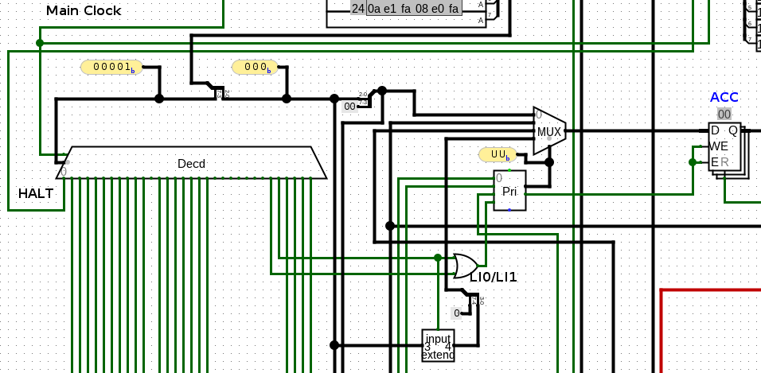

Tiny CPU in Logisim
===================

This repository contains a very tiny CPU implemented in [Logisim][1]. How tiny?
Well, _very_ tiny. It's restricted to 256-byte ROM and 256-byte RAM and has only
a handful arithmetic-logic instructions, just enough to write toy programs like
Fibonacci number calculator to prove the concept.

It implements a custom instruction set (described in [`ISA.md`][2]). The
instruction set is a fixed-with 8-bit ISA, which imposes severe restrictions on
what is possible to achieve.

The goal of this project was self-education, and I learned a ton. The project is
"complete": I don't intend to expand on it in any way, or even fix the design
blunders. Let the sore thumbs stick. (Although I might get around to replicating
it on a physical silicon one day).

# Contents



## The CPU

[`8b_cpu_isa2.circ`][3] contains the entire CPU in one drawing. It's not large,
almost workable in a fit-to-screen zoom level if the screen is big enough. You
will need [Logisim Evolution][1] for working with it (or navigating
comfortably). [Here](images/cpu-full.png) is a screenshot of the entire design.

## ISA spec

[`ISA.md`][2] contains a copy of the instruction set document I was using for
fleshing out the ideas.

## Assembler and disassembler

[`assembler/`][4] contains Go code for the assembler and disassembler. Pass an
assembly file on the command line to assemble. This will produce a ROM dump that
you can load in Logisim:

```
$ go run main.go fib.s
v3.0 hex words addressed
00: 09 4f 4e 08 1e 89 1f 89 4d 57 4a 56 7f 4f 52 4e
10: 09 e2 fa 55 1f 89 4d 08 e0 f9 00 00 00 00 00 00
20: 00 00 00 00 00 00 00 00 00 00 00 00 00 00 00 00
30: 00 00 00 00 00 00 00 00 00 00 00 00 00 00 00 00
40: 00 00 00 00 00 00 00 00 00 00 00 00 00 00 00 00
50: 00 00 00 00 00 00 00 00 00 00 00 00 00 00 00 00
60: 00 00 00 00 00 00 00 00 00 00 00 00 00 00 00 00
70: 00 00 00 00 00 00 00 00 00 00 00 00 00 00 00 00
80: 00 00 00 00 00 00 00 00 00 00 00 00 00 00 00 00
90: 00 00 00 00 00 00 00 00 00 00 00 00 00 00 00 00
a0: 00 00 00 00 00 00 00 00 00 00 00 00 00 00 00 00
b0: 00 00 00 00 00 00 00 00 00 00 00 00 00 00 00 00
c0: 00 00 00 00 00 00 00 00 00 00 00 00 00 00 00 00
d0: 00 00 00 00 00 00 00 00 00 00 00 00 00 00 00 00
e0: 00 00 00 00 00 00 00 00 00 00 00 00 00 00 00 00
f0: 00 00 00 00 00 00 00 00 00 00 00 00 00 00 00 00
```

Pass `-d` argument to disassemble:

```
$ go run main.go -d fib.rom
  0:	09	li	 0x1
  1:	4f	getacc	 r7
  2:	4e	getacc	 r6
  3:	08	li	 0x0
  4:	1e	st	 r6
  5:	89	inc	 0x1
  6:	1f	st	 r7
  7:	89	inc	 0x1
  8:	4d	getacc	 r5
  9:	57	setacc	 r7
 10:	4a	getacc	 r2
 11:	56	setacc	 r6
 12:	7f	add	 r7
 13:	4f	getacc	 r7
 14:	52	setacc	 r2
 15:	4e	getacc	 r6
 16:	09	li	 0x1
 17:	e2	sjf	 0x2
 18:	fa	jmphi	 0x2
 19:	55	setacc	 r5
 20:	1f	st	 r7
 21:	89	inc	 0x1
 22:	4d	getacc	 r5
 23:	08	li	 0x0
 24:	e0	sjf	 0x0
 25:	f9	jmphi	 0x1
```

[1]: https://github.com/logisim-evolution/logisim-evolution
[2]: https://github.com/rtfb/logisim-tiny-cpu/blob/master/ISA.md
[3]: https://github.com/rtfb/logisim-tiny-cpu/blob/master/8b_cpu_isa2.circ
[4]: https://github.com/rtfb/logisim-tiny-cpu/blob/master/assembler/
